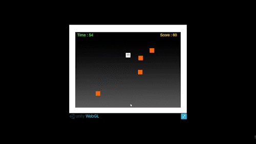
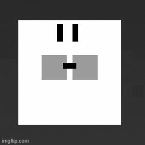

# Garb-The-Nuts
A simple game built in Unity to move a hamster around to grab all the nuts and fill his little pouch. The hamster has one minute to hold as possible in his pouch. But as he fills his pouch he will start to slow down.

## Instructions for Grab The Nuts

Using a *joypad* or *WASD* to move the hamster around to grab all the nuts and fill his little pouch. The hamster has one minute to hold as possible in his pouch. But as he fills his pouch he will start to slow down.

A high score above 1000 is good.

I am new to game development and still learning the Unity Engine. For this project, I focused on the gameplay and its core mechanic using a simple cubist style.

__Hours:__ The game's core concept took 3 hours to develop, but attempts to add sound and polishing added far too many hours to the project.

__Development Team:__ Just myself, all the code, design, and sounds were produced by me.

This is the first game that I submitted to TriJam. The concept of this game was coded relatively quickly; however, adding sound correcting screen size display issues took far longer than I hoped for. The part following the classic 90/10 rule, the last 10% of software development, took 90% of the time.

I'm pleased with the final game, although I welcome feedback, particularly any bugs or glitches that I missed. One of the issues I struggled with is the difference in the final presentation between the webGL on itch io playing in the unity development. I have a lot to learn. Feedback is most welcome

I look forward to applying myself to future game jams as I find it an excellent way to focus on what I have been learning the last few weeks.

I will return to this project when I have learned more about animation.
